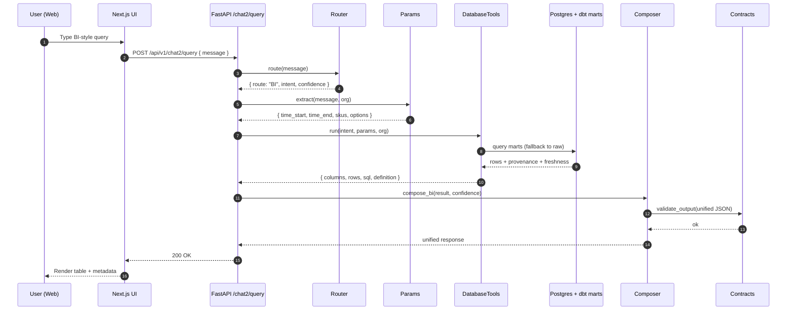
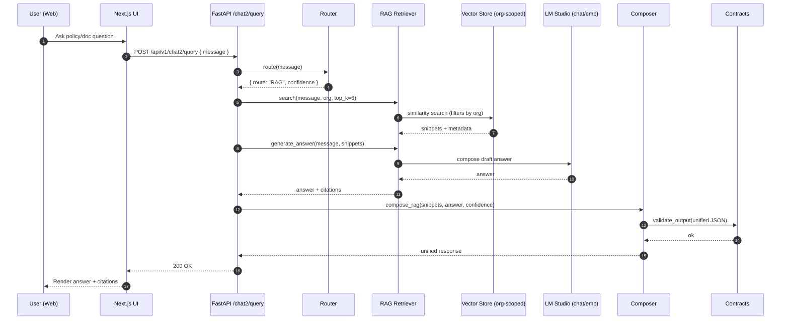
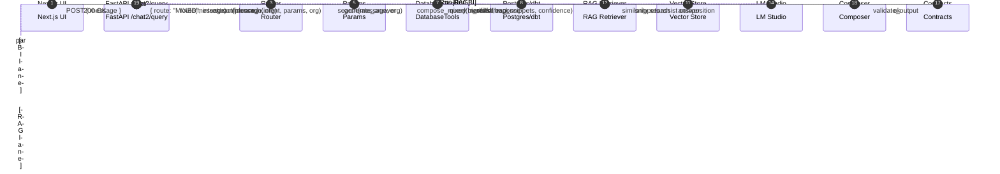

# StockPilot Chatbot Architecture

This document illustrates the chatbot system architecture and request flows based on the current repository design (legacy BI chat and hybrid chat) and the intended unified patterns.

## Component overview

```mermaid
flowchart LR
  subgraph FE[Next.js Frontend]
    UI[Chat UI + React Query hook\n`use-chat.ts`]
  end

  subgraph BE[FastAPI Backend]
    direction TB
    A1[/api/v1/chat/query\nLegacy BI Chat/]
    A2[/api/v1/chat2/query\nHybrid Chat (Unified)/]

    subgraph Core[Core Services]
      R[Router\nRules + Embeddings + LLM tiebreaker]
      P[Params Extractor\n`core/params.py`]
      C[Composer\n`core/composer.py`]
      V[Contracts Validator\n`core/contracts.py`]
    end

    subgraph Tools[Tools]
      DBT[DatabaseTools (BI)]
      RAG[Retriever (RAG)]
    end
  end

  subgraph LLM[LM Studio]
    LMChat[Chat Completions]
    LMEmb[Embeddings]
  end

  subgraph DATA[Data Layer]
    direction TB
    PG[(Postgres)]
    Marts[[dbt marts\n`backend/dbt/models/marts`]]
    Raw[(raw tables)]
    VS[(Vector Store\nChroma/pgvector)]
    Redis[(Redis cache):::opt]
  end

  classDef opt fill:#f8f9fa,stroke:#bbb,color:#666,stroke-dasharray: 3 3;

  UI -->|HTTP JSON| A1
  UI -->|HTTP JSON| A2

  %% Legacy BI endpoint
  A1 -->|intent rules + optional LLM fallback| C
  A1 -->|if prompt fallback| LMChat

  %% Hybrid endpoint orchestration
  A2 --> R
  R -->|BI decision| P
  R -->|RAG decision| RAG
  R -->|OPEN decision| LMChat
  R -->|Tie-breaker| LMChat

  %% BI path
  P --> DBT
  DBT -->|mart-first| Marts
  DBT -->|fallback| Raw
  Marts --> PG
  Raw --> PG
  DBT -. cache .-> Redis

  %% RAG path
  RAG --> VS
  RAG -->|answer compose or LLM assist| LMChat
  RAG -. embeddings .-> LMEmb
  R -. embeddings .-> LMEmb

  %% Composition + validation
  DBT --> C
  RAG --> C
  LMChat --> C
  C --> V

  %% Responses
  C --> A1
  C --> A2
```

Notes:

- Legacy endpoint focuses on BI intents with resilient LLM fallback for general chat.
- Hybrid endpoint routes between BI, RAG, MIXED (BI+RAG), and OPEN via Router, then composes and validates a unified response.
- BI is mart-first with explicit fallback to raw tables; no on-hand mutation anywhere (event-sourced inventory).
- LM Studio is the sole LLM provider for chat and embeddings.

## BI route – sequence



## RAG route – sequence



## MIXED route – sequence (BI + RAG in parallel)



## Multi-tenancy and guardrails

- Tenant boundary
  - Every request uses `Depends(get_current_claims)`; all DB queries filter by `org_id == claims['org']`.
  - RAG index must be partitioned or filtered by `org_id`; enforce at retrieval time to prevent cross-tenant leakage.
- Event-sourced analytics
  - Inventory on-hand is derived from movements; BI marts aggregate, never mutate stock.
- Mart-first analytics
  - Attempt dbt marts first; fallback to raw tables on failure; never rename existing response keys.
- Schema and provenance
  - All responses composed via `composer` and validated by `contracts.validate_output`.
  - BI responses include SQL/provenance/freshness; RAG responses require ≥1 citation.
- LLM constraints
  - LM Studio only (local); guardrails avoid fabricated numbers without SQL backing; OPEN route degrades gracefully.

## Performance and observability (recommended)

- Caching: BI result cache keyed by (intent, params, snapshot) with TTL; semantic cache for recent prompts.
- Parallelization: MIXED route runs BI and RAG in parallel; short-circuit on tool failures with helpful NO_ANSWER.
- Health and metrics: LM Studio health check; route distribution metrics; request/response logging and error tracking.
